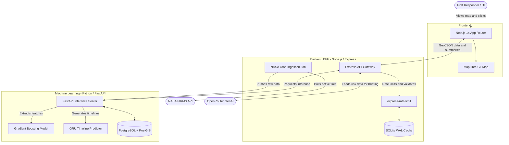

# System Architecture

PyroSense utilizes a 3-tier microservice architecture to decouple the heavy Python Machine Learning models from the fast, real-time Node.js web server.

## Architecture Flow Diagram

## Component Breakdown

1. **Next.js Frontend**: Pure presentation layer. It manages the MapLibre GL context and maintains responsive performance by clustering massive GeoJSON payloads locally.
2. **Express Backend (BFF)**: The orchestrator. It shields the heavy ML service from the public web. It manages strict rate limiting, caches frequent GenAI queries in SQLite, and runs the CRON jobs that fetch from NASA.
3. **FastAPI ML Service**: The brain. It hosts the `.pkl` and `.keras` models loaded entirely into memory. It leverages PostGIS to perform rapid geospatial intersection queries before running the mathematical tensors through the trained models.
